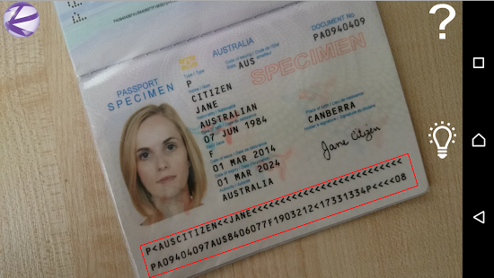

# Regula Document Reader

If you have any questinons, feel free to contact us at support@regulaforensics.com



* [How to build demo application](#how_to_build_demo_application)
* [How to use DocumentReader library](#how_to_use_documentreader_library)
* [Additional information](#additional_information)

## <a name="how_to_build_demo_application"></a> How to build demo application

1. Contact support@regulaforensics.com to get trial license for demo application.
1. Download and install latest [JDK](http://www.oracle.com/technetwork/java/javase/downloads/index.html).
1. Download and install latest [Android Studio](https://developer.android.com/studio/index.html).
1. Launch Android Studio and select "Open an existing Android Studio project" then select "RegulaDocumentReader-Android/RegulaDocumentReader" project in file browser.
1. Download additional files proposed by Android Studio to build project (build tools, for example).
1. Build and run application on device.

## <a name="how_to_use_documentreader_library"></a> How to use DocumentReader library

The very first step you should make is set up license file:
```java
documentReader = DocumentReader.getInstance();
boolean isLicenseOk=false;
try {
    InputStream licInput = getResources().openRawResource(R.raw.regula_license);
    byte[] license = new byte[licInput.available()];
    licInput.read(license);
    isLicenseOk = documentReader.setLibLicense(license);
    licInput.close();
} catch (IOException e) {
    e.printStackTrace();
}  
```

License file contains information about your application id and time terms. If `setLibLicense()` method returns false, you can see additional information in logcat.

When license file installed, all you need to do is to call only one function to process bitmap or video frame:
```java
// Bitmap processing
Bitmap bmp = getBitmap(selectedImage);
int status = documentReader.processBitmap(bmp);
if(status == MRZDetectorErrorCode.MRZ_RECOGNIZED_CONFIDENTLY) {
  // MRZ recognized, fetch results
  TextField surnameTextField = documentReader.getTextFieldByType(eVisualFieldType.ft_Surname);
  String surname = surnameTextField.bufText;
  ...
} else {
  // MRZ not recognized
}

// Video frame processing
public void onPreviewFrame(byte[] data, final Camera camera) {
    int status = documentReader.processVideoFrame(
      data, camPreview.camW, camPreview.camH, camPreview.params.getPreviewFormat());
    if (status == MRZDetectorErrorCode.MRZ_RECOGNIZED_CONFIDENTLY) {
      // MRZ recognized, fetch results
      TextField surnameTextField = documentReader.getTextFieldByType(eVisualFieldType.ft_Surname);
      String surname = surnameTextField.bufText;   
      ...
    }
    else {
      // MRZ not recognized
    }
}
```

Or you can call `CaptureActivity` that implemets all camera work for you:
```java
Intent intent = new Intent(MainActivity.this, CaptureActivity.class);
MainActivity.this.startActivityForResult(intent, DocumentReader.READER_REQUEST_CODE);
...
@Override
protected void onActivityResult(int requestCode, int resultCode, Intent data) {
    super.onActivityResult(requestCode, resultCode, data);
    if (resultCode == RESULT_OK && requestCode == DocumentReader.READER_REQUEST_CODE){
        // MRZ recognized, fetch results
        TextField surnameTextField = documentReader.getTextFieldByType(eVisualFieldType.ft_Surname);
        String surname = surnameTextField.bufText;
        ...
    }
}
```

Additional details of how to use `CaptureActivity` you can find in demo application code.

## <a name="additional_information"></a> Additional information
If you have any questinons, feel free to contact us at support@regulaforensics.com
